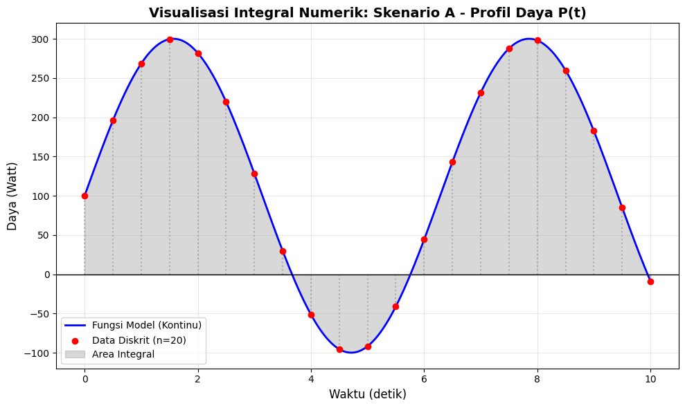
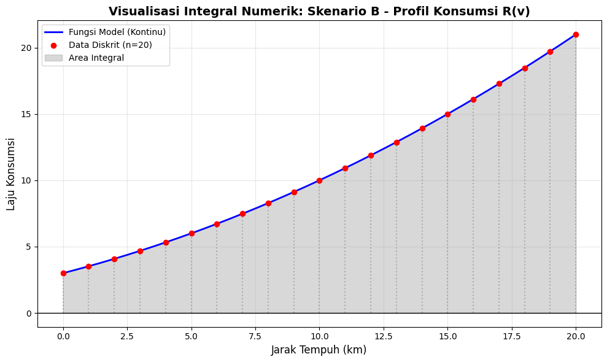

# Laporan Studi Kasus Komputasi Numerik: Integral Numerik

Repositori ini berisi implementasi kode Python untuk menyelesaikan masalah integral numerik menggunakan **Metode Trapesium** dan **Metode Simpson 1/3** untuk menganalisis profil daya listrik dan konsumsi bahan bakar.

## Struktur Direktori

```plaintext
integral-numerik-case
├── code
│   ├── main.ipynb        # Notebook Jupyter (opsional/Alternatif)
│   └── main.py           # Script utama Python
├── image
│   ├── visualisasi_A.png # Hasil plot Skenario A (Daya Listrik)
│   └── visualisasi_B.png # Hasil plot Skenario B (Bahan Bakar)
└── README.md
````

## Deskripsi Masalah

Studi kasus ini melibatkan dua skenario perhitungan nilai akumulatif (integral) dari data fungsi sesaat:

  * **Skenario A (Energi Listrik):** Menghitung total energi (Joule) dari fungsi daya $P(t)$.
  * **Skenario B (Konsumsi Bahan Bakar):** Menghitung total konsumsi (Liter) dari fungsi laju konsumsi $R(v)$.

## Model Matematis

Berikut adalah detail fungsi dan parameter yang digunakan dalam simulasi:

### Skenario A: Profil Daya

Menghitung integral tentu untuk mencari Total Energi.

  * **Fungsi:**
    $$P(t) = 100 + 200 \sin(t)$$
  * **Domain:** $t \in [0, 10]$ (detik)
  * **Jumlah Pias ($n$):** 20
  * **Lebar Pias ($h$):** $0.5$

### Skenario B: Profil Konsumsi

Menghitung integral tentu untuk mencari Total Bahan Bakar.

  * **Fungsi:**
    $$R(v) = 0.02v^2 + 0.5v + 3$$
  * **Domain:** $v \in [0, 20]$ (km)
  * **Jumlah Pias ($n$):** 20
  * **Lebar Pias ($h$):** $1.0$

## Implementasi Kode

Kode ditulis menggunakan **Python** dengan memanfaatkan pustaka **NumPy** untuk perhitungan vektorisasi yang efisien dan **Matplotlib** untuk visualisasi. File utama terletak di `code/main.py`.

### 1\. Algoritma Numerik

Implementasi metode numerik dibuat secara manual (*from scratch*) untuk mendemonstrasikan pemahaman algoritma.

#### Metode Trapesium

Menggunakan pendekatan linear antar titik. Rumus yang digunakan:

$$I \approx \frac{h}{2} [f_0 + 2 \sum_{i=1}^{n-1} f_i + f_n]$$

Implementasi Python:

```python
# Menjumlahkan seluruh elemen array dari indeks 1 sampai n (eksklusif)
integral = (h / 2) * (y[0] + 2 * np.sum(y[1:n]) + y[n])
```

#### Metode Simpson 1/3

Menggunakan pendekatan parabola (polinomial orde 2). Rumus yang digunakan:

$$I \approx \frac{h}{3} [f_0 + 4 \sum f_{\text{ganjil}} + 2 \sum f_{\text{genap}} + f_n]$$

Implementasi Python menggunakan *array slicing*:

```python
sigma_ganjil = np.sum(y[1:n:2]) # Indeks 1, 3, 5, ...
sigma_genap = np.sum(y[2:n:2])  # Indeks 2, 4, 6, ...

integral = (h / 3) * (y[0] + 4 * sigma_ganjil + 2 * sigma_genap + y[n])
```

## Hasil Analisis

Berikut adalah ringkasan perbandingan hasil eksekusi program.

### Skenario A: Energi Listrik (0-10 detik)

  * Parameter: $h=0.5$

| Metode | Hasil Perhitungan | Satuan |
| :--- | :--- | :--- |
| **Trapesium** | 1360.1194 | Joule |
| **Simpson 1/3** | 1367.9459 | Joule |

> **Visualisasi Skenario A:**
> 

### Skenario B: Konsumsi Bahan Bakar (0-20 km)

  * Parameter: $h=1.0$

| Metode | Hasil Perhitungan | Satuan |
| :--- | :--- | :--- |
| **Trapesium** | 213.4000 | Liter |
| **Simpson 1/3** | 213.3333 | Liter |

> **Visualisasi Skenario B:**
> 

## Cara Menjalankan Program

Ikuti langkah berikut untuk menjalankan simulasi di mesin lokal Anda.

### Prasyarat

Pastikan Anda telah menginstal Python dan pustaka yang dibutuhkan:

```bash
pip install numpy matplotlib
```

### Eksekusi

1.  Clone atau unduh repositori ini.
2.  Masuk ke direktori `code`.
3.  Jalankan perintah berikut di terminal:

<!-- end list -->

```bash
cd code
python main.py
```

Program akan mencetak hasil perhitungan ke terminal (stdout) dan menampilkan jendela *pop-up* untuk grafik visualisasi secara berurutan.